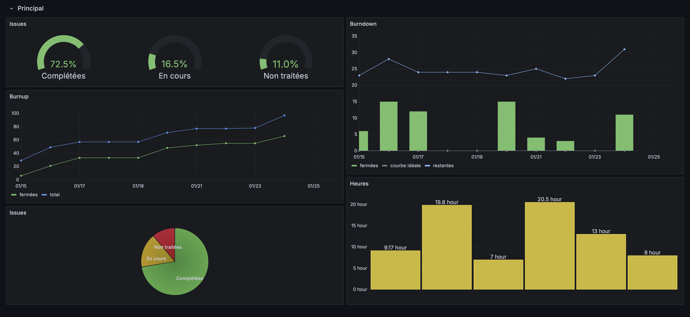
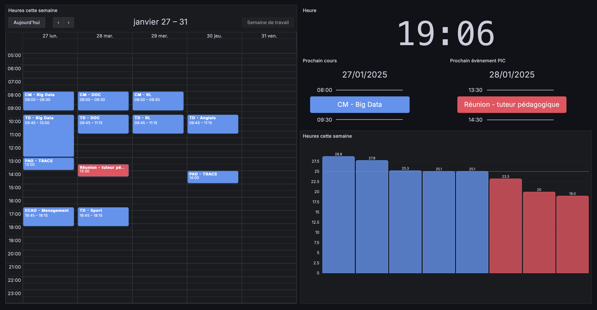
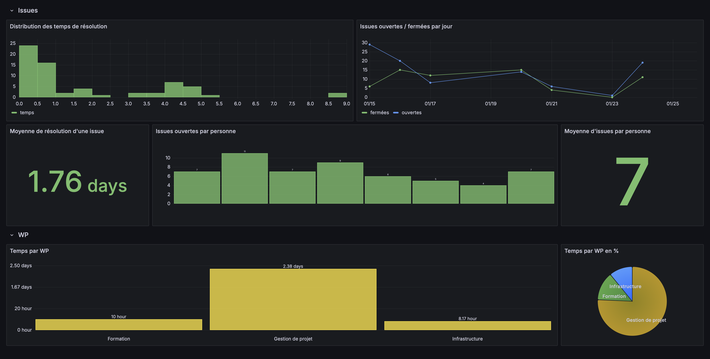

# KPI Dashboard API

Cette application est une API REST construite avec FastAPI et Poetry, permettant de formater les données provenant de GitLab, Kimai et CalDAV (Nextcloud) pour créer des dashboards dans Grafana.



## Fonctionnalités

- Intégration avec GitLab pour récupérer les issues et autres données pertinentes via l'API GraphQL.
- Intégration avec Kimai pour récupérer les données de suivi du temps.
- Intégration avec CalDAV (Nextcloud) pour afficher les événements de calendrier.
- Formatage des données pour une utilisation facile avec Grafana (source Infinity).

## Prérequis

- Docker et Docker Compose
- Accès aux API de GitLab, Kimai et CalDAV avec les informations d'identification correspondantes.

## Installation

### 1. Cloner le dépôt

```bash
$ git clone https://github.com/qberal/kpi-api.git
$ cd kpi-api
```

### 2. Configurer les variables d'environnement

Créez un fichier `.env` à la racine du projet et remplissez-le avec les valeurs appropriées :

```env
# Pour l'API GitLab
GITLAB_URL=https://gitlab.example/api/graphql
ACCESS_TOKEN=gitlab_api_token

# Pour le screenshot du board
GITLAB_SESSION=your_gitlab_session_cookie
GITLAB_KNOWN_SIGN_IN=your_gitlab_known_sign_in_cookie

# Pour Kimai
KIMAI_URL=https://kimai.example
KIMAI_TOKEN=kimai_api_token

# Pour le calendrier Nextcloud
NEXTCLOUD_CALDAV_URL=https://nextcloud.example/remote.php/dav
NEXTCLOUD_USERNAME=user
NEXTCLOUD_PASSWORD=pass
```

### 3. Démarrer l'application avec Docker Compose

Le projet inclut un fichier `docker-compose.yml` préconfiguré. Pour lancer l'application et Grafana :

```bash
$ docker compose up -d
```

- L'API sera disponible sur `http://localhost:8000`
- Grafana sera disponible sur `http://localhost:3000`

## Utilisation

### Points de terminaison principaux

#### Endpoint principal
```http
GET /
```
- Retourne un message de bienvenue pour l'API :
  ```json
  {
    "message": "Metrics API for GitLab and Kimai"
  }
  ```

#### GitLab

- **Temps passé par utilisateur**
  ```http
  GET /metrics/time_spent
  ```
  - **Paramètres** :
    - `group_path` : Chemin du groupe GitLab (obligatoire).
    - `created_after` : Date ISO pour filtrer les issues (obligatoire).

- **Issues ouvertes/fermées**
  ```http
  GET /metrics/opened_closed_issues
  ```
  - **Paramètres** :
    - `group_path` : Chemin du groupe GitLab (obligatoire).
    - `created_after` : Date ISO pour la période de début (obligatoire).
    - `created_before` : Date ISO pour la période de fin (obligatoire).

- **Burnup chart**
  ```http
  GET /metrics/burnup
  ```
  - **Paramètres** :
    - `group_path` : Chemin du groupe GitLab (obligatoire).
    - `created_after` : Date ISO pour la période de début (obligatoire).
    - `created_before` : Date ISO pour la période de fin (obligatoire).

- **Capture d'écran d'un board**
  ```http
  GET /gitlab/screenshot
  ```
  - Utilisé pour capturer un board GitLab en utilisant des cookies d'authentification.

#### Kimai

- **Heures enregistrées**
  ```http
  GET /kimai/hours
  ```
  - **Paramètres** :
    - `created_after` : Date ISO pour la période de début (obligatoire).
    - `created_before` : Date ISO pour la période de fin (obligatoire).

- **Heures de la semaine actuelle**
  ```http
  GET /kimai/current_week
  ```

- **Heures de la semaine précédente**
  ```http
  GET /kimai/last_week
  ```

#### CalDAV (Nextcloud)

- **Événements complets**
  ```http
  GET /calendar/full
  ```

- **Prochain cours**
  ```http
  GET /calendar/next_class
  ```

- **Prochain événement marquant**
  ```http
  GET /calendar/next_pic_event
  ```

### Configuration dans Grafana

1. Ajouter une nouvelle source de données :
   - Type : **Infinity**
   - URL : `http://localhost:8000` (ou l'URL appropriée si déployé ailleurs).
2. Créez des dashboards en utilisant les exemples fournis dans le dossier `dashboards`.

## Captures d'écran

[](calendar.png)

[](issues.png)

## License

Ce projet est sous licence MIT. Voir le fichier [LICENSE](./LICENSE) pour plus de détails.

